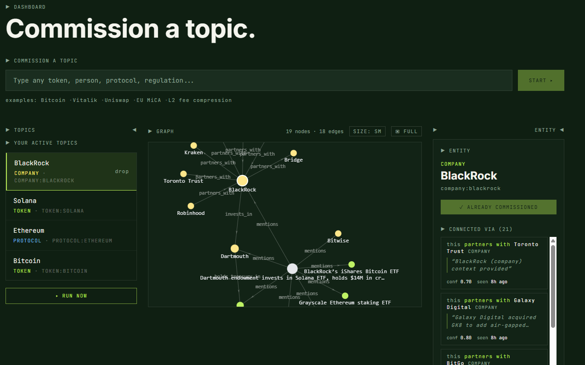
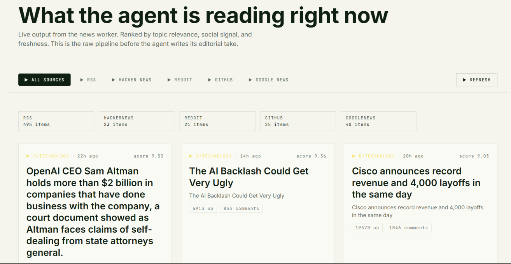

# Frame0

> **Frame0 turns scattered news and datasets into a typed knowledge graph that compounds with every run — built end-to-end on 0G.**
> Every LLM call is signed by the 0G Compute router. Every brief is anchored to 0G Storage. Every paywall settles on 0G Chain.

Built for the 0G hackathon. Live: [frame0-nine.vercel.app](https://frame0-nine.vercel.app)





---

## The problem

Crypto analysts and L2 comms teams rebuild the same intelligence every week. Google Alerts noise. Notion docs that nobody re-reads. Twitter lists scattered across phones. Briefs to leadership written from memory because the original article is buried four tabs deep.

Three things break: **the work doesn't compound**, **the output isn't verifiable**, and **the tools are scattered**. AI assistants help the *summarization* step and ignore the *compounding* step — they generate one-off summaries and forget everything immediately.

---

## What Frame0 does

You type a topic. The agent classifies it, persists a watcher, and starts ingesting from the sources you choose. Every RUN NOW produces:

- An **editorial brief** in the analyst's voice, with a `0g:<rootHash>` anchor on 0G Storage
- A **typed knowledge graph** that grows with every run — entities, relationships, and evidence quotes you can navigate
- **Alerts** that fire on material changes and push to Telegram, webhook, or in-app
- A **signed inference trace** for every LLM call (on-chain provider address + wei cost + request ID, from the 0G Compute router)

Ask the graph anything in `/chat`. Drop a CSV into `/dashboard`. Every action is logged in `/agent` with the 0G receipts attached.

---

## How it uses 0G

| Layer | Status | Used for |
|---|---|---|
| **0G Compute** | Live | Every classify, brief, extract, chat, and 7-day-summary call. Per-call `x_0g_trace` (provider, billing in wei, request ID) persisted to `traces`. |
| **0G Storage** | Live, gated by `OG_STORAGE_ENABLED` | Brief snapshots uploaded via `@0gfoundation/0g-storage-ts-sdk` (Indexer + MemData). Returns `0g:<rootHash>`. Falls back to `local:<sha256>` when the storage wallet is unfunded. |
| **0G Chain** | Live, gated by `OG_CHAIN_ENABLED` | `OGTimesPayment.sol` on Galileo testnet. 0.01 OG unlocks 24h of unlimited runs across every commission. Listener via viem `watchContractEvent`; verify-on-demand via `/api/payment/confirm` for missed events. |

Cost is bounded by design: one brief = one storage tx + a few inference calls. Chain commits are batched per-commission, not per-action.

---

## Architecture

```
            ┌─────────────────────────────────────────┐
            │   USER  (browser  +  MetaMask wallet)   │
            └────────────────────┬────────────────────┘
                                 │  Google OAuth (NextAuth v5)
            ┌────────────────────▼────────────────────┐
            │     Next.js 16 frontend  (Vercel)       │
            │  /dashboard  /chat  /sources            │
            │  /vault      /agent (audit log)         │
            └────────────────────┬────────────────────┘
                                 │  /api/proxy/*
                                 │  X-Wallet-Address  +  X-User-Email
            ┌────────────────────▼────────────────────┐
            │    Bun + Express backend  (Railway)     │
            │    bun:sqlite (WAL)  ·  Volume mount    │
            │                                         │
            │    classify  ·  editorial  ·  extract   │
            │    alerts engine  ·  payment access     │
            │    sources merge (RSS, YT, HN, Reddit)  │
            └─────┬───────────┬───────────┬──────────┘
                  │           │           │
                  ▼           ▼           ▼
          ┌──────────┐  ┌──────────┐  ┌──────────┐
          │ 0G       │  │ 0G       │  │ 0G       │
          │ Compute  │  │ Storage  │  │ Chain    │
          │ qwen 7B  │  │ Flow +   │  │ payment  │
          │ router   │  │ Indexer  │  │ contract │
          └──────────┘  └──────────┘  └──────────┘
```

---

## What's in the box

```
  Knowledge graph       7 entity types, 16 typed edge kinds, domain/range validator
                        articles persisted as nodes for navigability

  Editorial agent       per-run brief, 7-day LLM summary, per-commission chat Q&A
                        manual RUN NOW only — no autonomous polling

  Ingestion             BYO RSS + YouTube per commission, global news cache,
                        Google News fallback, CSV upload up to 20 rows

  Alerts                4 rule kinds (entity_mentioned, edge_type_added,
                        keyword_in_evidence, sentiment_drop), per-commission
                        Telegram subscriptions for alerts + brief digests

  Delivery              in-app log, webhook URL, Telegram bot (@ogtimes_bot)

  Verifiability         every LLM call has a 0G trace ID + provider + wei cost
                        every brief has a content hash anchored to 0G Storage
                        every payment settled on Galileo via OGTimesPayment

  Access                Google sign-in gates the app; free tier per email;
                        wallet-based payment unlocks 24h all-commission access

  Stack                 Bun + Express + bun:sqlite, Next.js 16 + React 19,
                        viem 2.49, ethers 6.16, react-force-graph-2d,
                        NextAuth v5, @0gfoundation/0g-storage-ts-sdk 1.2.9
```

---

## Deployed on 0G Galileo testnet (chain id 16602)

```
  Payment contract   0x2a8142Db4C3b90333339A6E25b225e808098BDB0
  Flow contract      0x22e03a6a89b950f1c82ec5e74f8eca321a105296   (storage)
  EVM RPC            https://evmrpc-testnet.0g.ai
  Storage indexer    https://indexer-storage-testnet-turbo.0g.ai
  Inference router   https://router-api-testnet.integratenetwork.work/v1
  Inference model    qwen/qwen-2.5-7b-instruct
  Telegram bot       @ogtimes_bot
```

---

## Demo path (90 seconds)

1. Sign in with Google at [frame0-nine.vercel.app](https://frame0-nine.vercel.app).
2. Type a topic (`Bitcoin`, `Solana`, `BlackRock`) → **START**.
3. Click **RUN NOW**. Up to 12 articles process per click. Watch the force-directed graph populate live; brief panel fills.
4. Click a node → see the "why connected" panel with verb phrases, evidence quotes, and source article links.
5. Open **`/chat`** → ask the graph a question (`what protocols mention Bitcoin?`). Answer comes with a 0G trace ID.
6. Drop `data/sample-acquisitions.csv` into the **Upload Dataset** panel on a BlackRock commission. Watch 10 rows extract into the same graph.
7. Open **`/agent`** → every action above with its 0G receipt. Total OG spend at the top.

---

## License

MIT.
